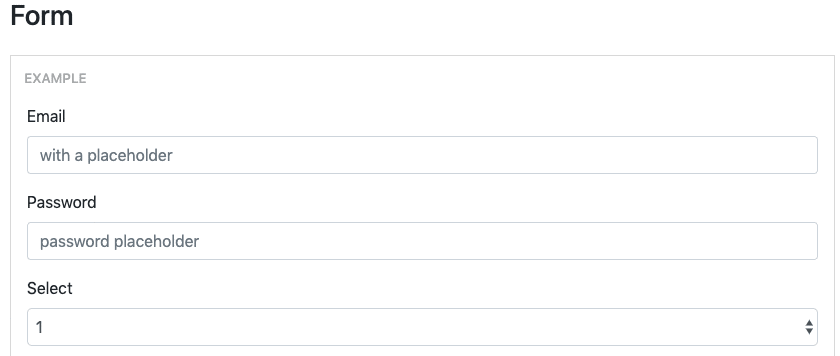

# puppeteer-core-controller

Fluent API around puppeteer-core

[](https://travis-ci.org/hdorgeval/puppeteer-core-controller)
[](https://ci.appveyor.com/project/hdorgeval/puppeteer-core-controller)
[](https://www.npmjs.com/package/puppeteer-core-controller)

## Usage

```js
import { PuppeteerController } from 'puppeteer-core-controller';

const pptc = new PuppeteerController();
const emailInputSelector = 'input#exampleEmail';
const passwordInputSelector = 'input#examplePassword';
const checkMeOutSelector = 'input[type="checkbox"].form-check-input';
const customSelect = 'select#exampleCustomSelect';
const option = 'Value 3';

await pptc
  .initWith({
    headless: false,
  })
  .withMaxSizeWindow()
  .withCursor()
  .navigateTo('https://reactstrap.github.io/components/form/')
  .hover(emailInputSelector)
  .click(emailInputSelector)
  .typeText('foo.bar@baz.com')
  .pressKey('Tab');
  .expectThat(passwordInputSelector).hasFocus({ timeoutInMilliseconds: 5000 })
  .typeText("don't tell!")
  .pressKey('Tab');
  .expectThat(passwordInputSelector).hasClass('is-valid')
  .hover(checkMeOutSelector)
  .click(checkMeOutSelector)
  .select(option).in(customSelect)
  .close();
```

## Usage in an existing code base

```js
import { PuppeteerController } from 'puppeteer-core-controller';

// existing code that has a browser and page instance
// ...

const pptc = new PuppeteerController(browser, page);
const emailInputSelector = 'input#exampleEmail';
const passwordInputSelector = 'input#examplePassword';
const checkMeOutSelector = 'input[type="checkbox"].form-check-input';
const customSelect = 'select#exampleCustomSelect';
const option = 'Value 3';

await pptc
  .navigateTo('https://reactstrap.github.io/components/form/')
  .click(emailInputSelector)
  .typeText('foo.bar@baz.com')
  .pressKey('Tab');
  .expectThat(passwordInputSelector).hasFocus({ timeoutInMilliseconds: 5000 })
  .typeText("don't tell!")
  .pressKey('Tab');
  .expectThat(passwordInputSelector).hasClass('is-valid')
  .click(checkMeOutSelector)
  .select(option).in(customSelect)
  .close();
```

## Usage with Stories

```js
import { PuppeteerController, Story, StoryWithProps } from 'puppeteer-core-controller';

const pptc = new PuppeteerController();
const launchOptions: LaunchOptions = {
  headless: true,
};
const url = 'https://reactstrap.github.io/components/form';
const customSelect = 'select#exampleCustomSelect';
const option = 'Value 3';

interface StartOptions {
  launchOptions: LaunchOptions;
  url: string;
}

const openApplication: StoryWithProps<StartOptions> = async (pptc, props) => {
  await pptc
    .initWith(props.launchOptions)
    .withMaxSizeWindow()
    .withCursor()
    .navigateTo(props.url);
};

const fillForm: Story = async (pptc) => {
  await pptc
    .click(customSelect)
    .select(option)
    .in(customSelect);
};

const params: StartOptions = { launchOptions, url };
await pptc
  .runStory(openApplication, params)
  .runStory(fillForm)
  .close();
```

## API

### initWith([options])

- options: same object as [puppeteer.launch([options])](https://github.com/GoogleChrome/puppeteer/blob/v1.18.1/docs/api.md#puppeteerlaunchoptions)

---

### withMaxSizeWindow()

- maximize the window size. Should be called after `initWith` and before all other actions.

---

### withCursor()

- show a cursor that is bound to the current mouse position. This method should be called before navigateTo(url).



---

### navigateTo(url)

- navigate to the specified url

---

### click(selector[, options])

- selector: string
- options: same object as [page.click(selector[, options])](https://github.com/GoogleChrome/puppeteer/blob/v1.18.1/docs/api.md#pageclickselector-options)

  with an additional property: `timeoutInMilliseconds`. This option enables the click method to wait for the selector to appear in the DOM before attempting to click on it. Defaults to 30000 (30 seconds). Pass 0 to disable this timeout.

---

### hover(selector[, options])

- selector: string
- options: {steps: number, timeoutInMilliseconds: number }

  `timeoutInMilliseconds` option enables the hover method to wait for the selector to appear in the DOM before attempting to move the mouse on it. Defaults to 30000 (30 seconds). Pass 0 to disable this timeout.

---

### typeText(text[, options])

- text: string
- options: same object as [keyboard.type(text[, options])](https://github.com/GoogleChrome/puppeteer/blob/v1.18.1/docs/api.md#keyboardtypetext-options)

  except that `delay` defaults to 50 milliseconds. Set the `delay` value to `0` to disable the delay.

---

### pressKey(key[, options])

- key: 'Tab' | 'Backspace' | 'Enter'
- options: same object as [keyboard.press(key[, options])](https://github.com/GoogleChrome/puppeteer/blob/v1.18.1/docs/api.md#keyboardpresskey-options)

  except that `delay` defaults to 50 milliseconds. Set the `delay` value to `0` to disable the delay.

---

### select(values).in(selector[, options])

- values and selector: same as [page.select(selector, ...values)](https://github.com/GoogleChrome/puppeteer/blob/v1.18.1/docs/api.md#pageselectselector-values)
- options: {timeoutInMilliseconds}. This option enables the select method to wait for the selector to appear in the DOM before attempting to select the option(s). Defaults to 30000 (30 seconds). Pass 0 to disable this timeout.

---

### find(selector[, waitOptions]).withText(text).click([clickOptions])

find a selector whose innerText property contains `text`, then click on it.

```js
await pptc
  .initWith({ headless: true })
  .withCursor()
  .navigateTo('https://reactstrap.github.io')
  .find('a.btn')
  .withText('Components')
  .click();
```

- selector: string
- waitOptions: {timeoutInMilliseconds: number}.
  The find method will wait for the selector to to be visible until `timeoutInMilliseconds` expires. Defaults to 30000 (30 seconds).
- withText(text)
- clickOptions: same object as [page.click(selector[, options])](https://github.com/GoogleChrome/puppeteer/blob/v1.18.1/docs/api.md#pageclickselector-options)

---

### find(selector[, waitOptions]).withExactText(text).click([clickOptions])

find a selector whose innerText property is equal to `text`, then click on it.

```js
await pptc
  .initWith({ headless: true })
  .withCursor()
  .navigateTo('https://reactstrap.github.io')
  .find('a.btn')
  .withExactText('Components')
  .click();
```

- selector: string
- waitOptions: {timeoutInMilliseconds: number}.
  The find method will wait for the selector to to be visible until `timeoutInMilliseconds` expires. Defaults to 30000 (30 seconds).
- withExactText(text)
- clickOptions: same object as [page.click(selector[, options])](https://github.com/GoogleChrome/puppeteer/blob/v1.18.1/docs/api.md#pageclickselector-options)

---

### expecThat(selector).hasFocus([options])

- selector: string
- options: {timeoutInMilliseconds}. This option enables the assertion mechanism to wait for the selector to have the focus. Defaults to 30000 (30 seconds).

---

### expecThat(selector).hasClass(className,[options])

- selector: string
- className: string
- options: {timeoutInMilliseconds}. This option enables the assertion mechanism to wait for the selector to have the specified class. Defaults to 30000 (30 seconds).

---

### getComputedStyleOf(selector)

- selector: string

  ```js
  const validInput = 'input[type="text"].is-valid.form-control';
  const computedStyles = await pptc.getComputedStyleOf(validInput);
  expect(computedStyles.borderColor).toBe('rgb(40, 167, 69)');
  ```

---

### getClientRectangleOf(selector)

- selector: string

  ```js
  const selector = 'input[type="text"].is-valid.form-control';
  const selectorClientRectangle = await pptc.getClientRectangleOf(selector);

  const middleX = selectorClientRectangle.left + selectorClientRectangle.width / 2;
  const middleY = selectorClientRectangle.top + selectorClientRectangle.height / 2;

  const expectedMiddleX = 100;
  const expectedMiddleY = 100;

  expect(Math.abs(middleX - expectedMiddleX)).toBeLessThanOrEqual(1);
  expect(Math.abs(middleY - expectedMiddleY)).toBeLessThanOrEqual(1);
  ```

---

### runStory(story)

- story: Story

---

### getInstances()

- get browser and page instances of the controller in order to do stuff not covered by this API.

  ```js
  const pptc = new PuppeteerController();

  // use the pptc controller API
  // ...

  const [browser, page] = pptc.getIntances();
  // now use the browser and page instances through the puppeteer API
  ```

---

### cast(any)

- cast input object as a PuppeteerController instance; usefull when a PuppeteerController instance is stored in an untyped context like in cucumberJS.

```js
const pptc = cast(this.context.pptc);
// use the pptc controller API
// ...
```

---
